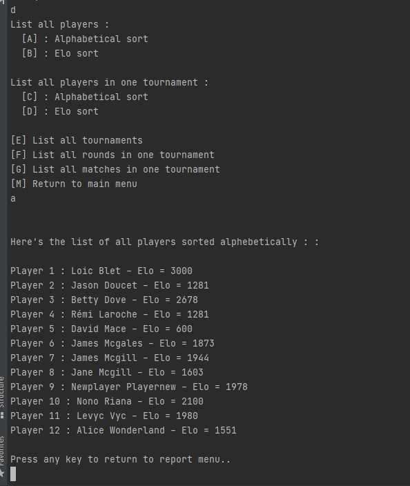

# P4MVC

## Introduction

This python project is a swiss-system chess tournament manager.  
Any tournament or player is registered in a json file using TinyDB.  
It can be split in 4 parts :  
-The user creates or uses 8 existing players and starts a tournament, looping through the 4 ( or more ) matches  
-The user resumes an unfinished tournament  
-The user edits existing players in the databse  
-The use generates various reports( for instance : show all existing tournaments ) from the saved data  

## Install
1.Download the github project, unzip it in the folder of your choosing  
2.Using a terminal, place yourself in the project folder and create a virtual environnement using :  
`python -m venv env`  
3.Activate the virtual environnement using :  
windows : `env/Scripts/activate.bat`  
linux / mac : `source env/bin/activate`  
4.Install the python packages needed to run the programm using :  
`pip install -r requirements.txt`  
5.Run the launcher using :  
`python main.py`  

## Flake-8 Report
To generate a Flake8-html report, use :  
`flake8 --format=html --htmldir=flake-report`  
The setup.cfg file is set to 119 for the max line length.
You can then open the .html files using any web browser of your choosing.  

## Example
**Main Menu :**  
  

**New tournament and matches played out :**  
  
  
  
  

**Player management (add player, edit elo ) :**  

  
  

**Report example ( show all players ):**  

  

